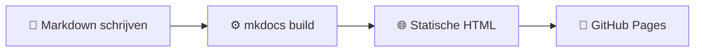
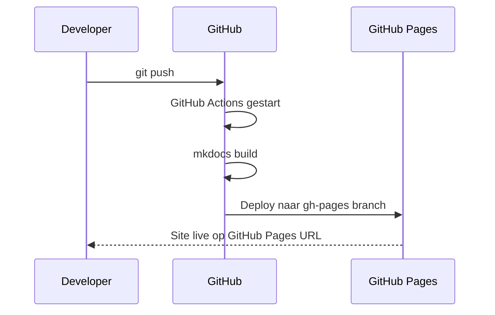

# Features

Deze pagina demonstreert alle belangrijkste functies van MkDocs Material op één plek — zonder dat je één regel HTML of CSS hoeft te schrijven.

---

## Admonitions

Admonitions zijn gekleurde blokken om informatie te benadrukken. Er zijn negen varianten beschikbaar.

!!! note "Notitie"
    Gebruik dit voor algemene aanvullende informatie.

!!! tip "Tip"
    Gebruik dit voor handige suggesties en best practices.

!!! warning "Waarschuwing"
    Gebruik dit voor potentiële problemen waar de lezer op moet letten.

!!! danger "Gevaar"
    Gebruik dit voor kritieke informatie die schade kan voorkomen.

!!! success "Succes"
    Gebruik dit om een positief resultaat te bevestigen.

!!! info "Informatie"
    Gebruik dit voor neutrale, informatieve context.

??? "Inklapbaar blok (klik om te openen)"
    Dit blok is standaard ingeklapt. Ideaal voor aanvullende informatie die niet iedereen nodig heeft.

???+ "Standaard open inklapbaar blok"
    Dit blok is standaard open, maar kan ingeklapt worden. Gebruik `???+` in plaats van `???`.

---

## Tabs

Groepeer gerelateerde inhoud in overzichtelijke tabbladen — de lezer kiest zelf wat relevant is.

=== "Python"
    ```python
    def hello_world():
        print("Hallo, wereld!")

    hello_world()
    ```

=== "JavaScript"
    ```javascript
    function helloWorld() {
        console.log("Hallo, wereld!");
    }

    helloWorld();
    ```

=== "Bash"
    ```bash
    echo "Hallo, wereld!"
    ```

---

## Code Annotaties

Voeg genummerde annotaties toe aan codeblokken. Klik op de nummers voor uitleg.

```yaml
site_name: mkdocs-demo # (1)!
theme:
  name: material # (2)!
  language: nl   # (3)!
  palette:
    - scheme: slate # (4)!
      toggle:
        icon: material/weather-sunny # (5)!
```

1. De naam van je site — verschijnt in de browsertab en de navigatiebalk.
2. Het Material-thema geeft je direct een professionele uitstraling.
3. Alle UI-elementen worden automatisch vertaald naar Nederlands.
4. `slate` activeert de donkere modus als standaard kleurenschema.
5. Het icoon dat verschijnt in de dark/light mode toggle rechtsboven.

---

## Toetsenbordtoetsen

Toon toetsencombinaties op een herkenbare, visuele manier met de `pymdownx.keys` extensie.

| Actie             | Toetsencombinatie          |
|-------------------|----------------------------|
| Kopiëren          | ++ctrl+c++                 |
| Plakken           | ++ctrl+v++                 |
| Opslaan           | ++ctrl+s++                 |
| Alles selecteren  | ++ctrl+a++                 |
| Ongedaan maken    | ++ctrl+z++                 |
| Zoeken            | ++ctrl+f++                 |
| Nieuw venster     | ++ctrl+n++                 |
| Venster sluiten   | ++alt+f4++                 |

---

## Task Lists

Interactieve checkboxen voor checklists en stappenplannen.

- [x] MkDocs en Material thema installeren
- [x] `mkdocs.yml` configureren
- [x] Markdown pagina's schrijven
- [x] GitHub Actions workflow aanmaken
- [x] Deployen naar GitHub Pages
- [ ] Collega's overtuigen om ook MkDocs te gebruiken 😄

---

## Grid Cards

<div class="grid cards" markdown>

-   :material-alert-circle:{ .lg .middle } **Admonitions**

    ---

    Negen varianten van gekleurde blokken voor notities, tips, waarschuwingen en meer.

-   :material-tab:{ .lg .middle } **Tabs**

    ---

    Groepeer gerelateerde inhoud zodat de lezer zelf kiest wat relevant is.

-   :material-keyboard:{ .lg .middle } **Toetsenbordtoetsen**

    ---

    Toon toetsencombinaties op een herkenbare, visuele manier.

-   :material-check-all:{ .lg .middle } **Task lists**

    ---

    Interactieve checkboxen voor checklists en stappenplannen.

-   :material-code-tags:{ .lg .middle } **Code annotaties**

    ---

    Voeg genummerde uitleg toe aan codeblokken — ideaal voor technische documentatie.

-   :material-graph:{ .lg .middle } **Mermaid diagrammen**

    ---

    Teken flowcharts, sequentiediagrammen en meer in pure tekst.

</div>

---

## Mermaid Diagrammen

### Flowchart



### Sequentiediagram



---

## Tooltips op afkortingen

Hover over de volgende afkortingen om een automatische tooltip te zien — ingesteld via één centraal bestand, actief op de hele site.

De documentatie is geschreven in Markdown en geconfigureerd via YAML. Deployment verloopt via CI/CD naar GitHub Pages, zodat elke push automatisch resulteert in een bijgewerkte URL.