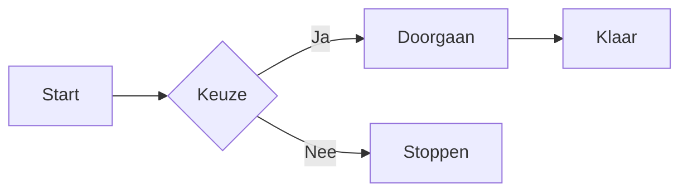
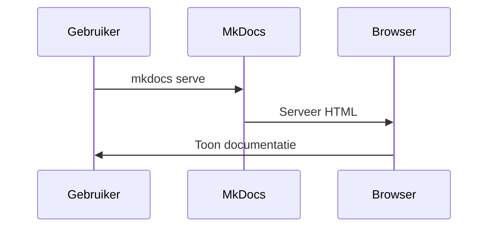
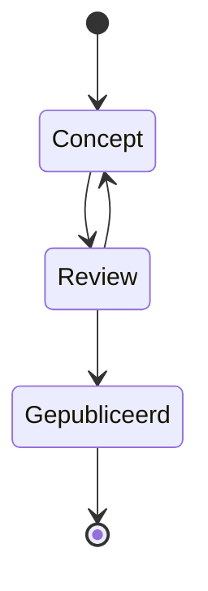

# Features

Deze pagina demonstreert de belangrijkste features van MkDocs met het
Material-thema. Gebruik deze pagina als referentie voor wat mogelijk is
binnen je documentatieomgeving.

---

## 404-pagina

Het Material-thema genereert automatisch een nette, gestyled 404-pagina wanneer
een bezoeker een niet-bestaande URL bezoekt. Hier is geen custom `404.md` voor
nodig — het werkt standaard out of the box.

### Vereiste configuratie

De enige vereiste is dat `site_url` correct is ingesteld in `mkdocs.yml`. Zonder
deze instelling worden CSS en JavaScript via relatieve paden geladen, waardoor
de 404-pagina zonder styling wordt getoond op sites die op een subpad draaien
(zoals `github.io/mkdocs-demo/`).

```yaml title="mkdocs.yml"
site_url: https://rhirschmann.github.io/mkdocs-demo/
```

!!! danger "Zonder site_url"
    Zonder `site_url` toont de 404-pagina een ongestylede versie met
    paginabrede iconen en onopgemaakte tekst. Dit komt doordat de browser
    de CSS- en JavaScript-bestanden niet kan vinden via relatieve paden.

!!! success "Met site_url"
    Met `site_url` worden alle assets via absolute paden geladen, waardoor
    de 404-pagina er identiek uitziet aan de rest van de site — inclusief
    navigatie, zoekfunctie en thema-instellingen.

### Overzicht 404-gedrag

| Situatie | Styling correct? | Opmerking |
|---|:---:|---|
| GitHub Pages met `site_url` | ✅ | Absolute paden voor CSS/JS |
| GitHub Pages zonder `site_url` | ❌ | Relatieve paden werken niet op subpad |
| `mkdocs serve` (lokaal) | ⚙️ | Dev-server toont eigen ingebouwde 404 |

!!! tip "Testen"
    Typ een niet-bestaande URL in de adresbalk om de 404-pagina in actie te zien,
    bijvoorbeeld:

    [Trigger een 404-pagina](../bestaat-niet/){ .md-button .md-button--primary }

---

## Meertaligheid (i18n)

MkDocs ondersteunt meertalige documentatie via de `mkdocs-static-i18n` plugin.
De UI-elementen van het Material-thema worden automatisch vertaald naar 60+ talen
via de `language` instelling in het thema.

### UI-taal instellen

De taal van alle UI-elementen (zoekbalk, navigatie, footer) wordt ingesteld via
het thema:

```yaml title="mkdocs.yml"
theme:
  name: material
  language: nl
```

### Meertalige content

Voor het aanbieden van documentatie in meerdere talen kan de `mkdocs-static-i18n`
plugin gebruikt worden. Installeer deze via pip:

```bash
pip install mkdocs-static-i18n
```

Configureer vervolgens de talen in `mkdocs.yml`:

```yaml title="mkdocs.yml"
plugins:
  - i18n:
      languages:
        - locale: nl
          default: true
          name: Nederlands
        - locale: en
          name: English
          build: true
```

### Bestandsnaamconventie

Vertaalde pagina's worden aangeduid met een taalsuffix in de bestandsnaam.
De standaardtaal heeft geen suffix nodig.

```
docs/
├── index.md          # Nederlands (standaard)
├── index.en.md       # Engels
├── about/
│   ├── index.md      # Nederlands (standaard)
│   └── index.en.md   # Engels
└── ...
```

### Taalschakelaar

Na het configureren van de plugin verschijnt er automatisch een taalschakelaar
in de header van de site. Bezoekers kunnen hiermee eenvoudig wisselen tussen
de beschikbare talen.

| Instelling | Gedrag |
|---|---|
| `default: true` | Deze taal wordt standaard getoond |
| `build: true` | De vertaling wordt meegebouwd |
| Geen `.en.md` variant | Pagina wordt alleen in de standaardtaal getoond |

!!! danger "Niet compatibel met de Blog plugin"
    De `mkdocs-static-i18n` plugin is **niet compatibel** met de ingebouwde
    Material blog plugin. Blogposts worden niet meer getoond wanneer beide
    plugins tegelijkertijd actief zijn. Dit is een bevestigd probleem zonder
    oplossing ([GitHub Issue #4863](https://github.com/squidfunk/mkdocs-material/issues/4863)).
    Kies daarom voor **óf** de blog plugin **óf** de i18n plugin.

!!! warning "navigation.instant"
    De taalschakelaar is niet compatibel met de `navigation.instant` feature.
    Verwijder deze uit je thema-configuratie wanneer je de i18n plugin gebruikt.

!!! tip "Niet alles hoeft vertaald"
    Pagina's zonder vertaling worden automatisch in de standaardtaal getoond.
    Je hoeft dus niet alle pagina's te vertalen om meertaligheid te activeren.

!!! info "Deze demo"
    In deze demo is gekozen voor de blog plugin. Meertaligheid via de i18n
    plugin is daarom niet geactiveerd maar wel gedocumenteerd op deze pagina
    als referentie.

---

## Tags

Tags worden bovenaan de pagina getoond en maken het eenvoudig om pagina's
te categoriseren en terug te vinden via de tagpagina. Voeg tags toe via
de frontmatter bovenaan een Markdown-bestand:

```yaml
---
tags:
  - demo
  - features
  - overzicht
---
```

### Tags verbergen

Tags blijven altijd werken in de zoekfunctie en op de [tagpagina](tags.md),
ook als ze visueel verborgen zijn op de pagina zelf. Voeg `tags` toe aan de
`hide` lijst in de frontmatter om ze te verbergen:

```yaml
---
tags:
  - demo
  - features
hide:
  - tags
---
```

### Overzicht taggedrag

| Instelling | Zichtbaar op pagina | Zichtbaar in zoekfunctie | Zichtbaar op tagpagina |
|---|:---:|:---:|:---:|
| Tags zonder `hide` | ✅ | ✅ | ✅ |
| Tags met `hide: tags` | ❌ | ✅ | ✅ |
| Geen tags | ❌ | ❌ | ❌ |

!!! tip "Best practice"
    Voeg tags altijd toe via de frontmatter, ook als je ze visueel verbergt.
    Ze blijven dan doorzoekbaar en zichtbaar op de tagpagina.

---

## Admonitions

Admonitions zijn gekleurde blokken om de lezer te attenderen op
belangrijke informatie. MkDocs Material ondersteunt meerdere typen.

!!! note "Opmerking"
    Dit is een informatieve opmerking, handig voor aanvullende uitleg.

!!! tip "Tip"
    Gebruik tips om de lezer te wijzen op handige trucs of shortcuts.

!!! warning "Let op"
    Gebruik dit blok om de lezer te waarschuwen voor mogelijke valkuilen.

!!! danger "Gevaar"
    Dit blok is bedoeld voor kritieke meldingen die directe aandacht vereisen.

!!! success "Succes"
    Gebruik dit om een succesvol resultaat of een positieve bevestiging te tonen.

!!! info "Informatie"
    Extra achtergrondinformatie die niet direct noodzakelijk is, maar nuttig kan zijn.

??? example "Uitklapbaar voorbeeld (klik om te openen)"
    Dit is een collapsible admonition. De inhoud is standaard verborgen
    en kan worden uitgeklapt door op de titel te klikken.

---

## Code Blokken

Code blokken worden gerenderd met syntaxkleuring en een ingebouwde
kopieerknop. Meerdere programmeertalen worden ondersteund.

```python title="hello_world.py" linenums="1"
def hello_world(name: str) -> str:
    """Geeft een begroeting terug."""
    return f"Hallo, {name}!"

print(hello_world("MkDocs"))
```

```bash title="installatie"
pip install mkdocs mkdocs-material
mkdocs serve
```

```yaml title="mkdocs.yml"
site_name: Mijn Documentatie
theme:
  name: material
  language: nl
```

---

## Content Tabs

Met content tabs kun je gerelateerde inhoud naast elkaar tonen, zoals
voorbeeldcode in meerdere programmeertalen.

=== "Python"
    ```python
    def groet():
        print("Hallo vanuit Python!")
    ```

=== "JavaScript"
    ```javascript
    function groet() {
        console.log("Hallo vanuit JavaScript!");
    }
    ```

=== "Bash"
    ```bash
    echo "Hallo vanuit Bash!"
    ```

=== "PowerShell"
    ```powershell
    Write-Host "Hallo vanuit PowerShell!"
    ```

---

## Grids & Cards

Cards bieden een visuele manier om features of onderwerpen overzichtelijk
te presenteren.

<div class="grid cards" markdown>

-   :material-clock-fast:{ .lg .middle } __Snel opgezet__

    ---

    Binnen enkele minuten een professionele documentatiesite draaien
    met MkDocs en het Material-thema.

-   :material-language-markdown:{ .lg .middle } __Markdown__

    ---

    Schrijf documentatie in eenvoudige Markdown-syntax, zonder kennis
    van HTML of CSS.

-   :material-magnify:{ .lg .middle } __Zoekfunctie__

    ---

    Ingebouwde zoekfunctie doorzoekt alle pagina's direct in de browser,
    zonder externe diensten.

-   :material-palette:{ .lg .middle } __Thema & Stijlen__

    ---

    Pas kleuren, lettertypen en de lay-out volledig aan via de
    `mkdocs.yml` configuratie.

</div>

---

## Knoppen

MkDocs Material ondersteunt gestylede knoppen via CSS-klassen. Knoppen
kunnen worden gebruikt als call-to-action of voor navigatie.

[Primaire knop](#){ .md-button .md-button--primary }
[Secundaire knop](#){ .md-button }

---

## Afkortingen (Abbreviations)

Door gebruik te maken van het `includes/abbreviations.md` bestand worden
afkortingen automatisch voorzien van een tooltip. Beweeg je muis over de
onderstaande afkortingen om de uitleg te zien.

Deze documentatie is gebouwd met MkDocs en maakt gebruik van YAML voor
de configuratie. De HTML-output wordt gegenereerd via een CLI-commando.

--8<-- "includes/abbreviations.md"

---

## Mermaid Diagrammen

Met Mermaid kun je diagrammen en flowcharts schrijven in Markdown.
Onderstaande voorbeelden laten verschillende diagramtypen zien.

**Flowchart:**



**Sequentiediagram:**



**Statusdiagram:**



---

## Takenlijsten

Takenlijsten zijn handig om stappen of checklists overzichtelijk weer te
geven. Met de `tasklist` extensie worden de checkboxen visueel gestijld.

- [x] MkDocs installeren
- [x] Material-thema instellen
- [x] Navigatie configureren
- [x] Features pagina aanmaken
- [ ] Documentatie uitschrijven
- [ ] Publiceren naar GitHub Pages

---

## Tabellen

Tabellen worden volledig ondersteund in Markdown en zijn eenvoudig
leesbaar en uitbreidbaar.

| Feature            | Beschikbaar | Notitie                          |
|--------------------|:-----------:|----------------------------------|
| Tags               | ✅          | Via `material/tags` plugin       |
| Mermaid diagrammen | ✅          | Via `pymdownx.superfences`       |
| Zoekfunctie        | ✅          | Ingebouwd, geen plugin nodig     |
| Content Tabs       | ✅          | Via `pymdownx.tabbed`            |
| Admonitions        | ✅          | Via `admonition` extensie        |
| Afkortingen        | ✅          | Via `abbr` + snippets            |
| Knoppen            | ✅          | Via `attr_list` extensie         |
| Footnotes          | ✅          | Via `footnotes` extensie         |
| Grids & Cards      | ✅          | Via `md_in_html` + CSS klassen   |
| Versiebeheer       | ⚙️          | Via `mike` plugin (optioneel)    |

---

## Footnotes

Voetnoten zijn handig voor bronvermeldingen of aanvullende uitleg die de
hoofdtekst niet onderbreekt. Klik op het cijfer om naar de voetnoot te
springen.[^1]

MkDocs is een open-source project en actief onderhouden door de
community.[^2]

[^1]: Dit is een voetnoot. Je kunt hier bronvermeldingen of aanvullende
      informatie kwijt zonder de leesflow te onderbreken.
[^2]: Meer informatie op [mkdocs.org](https://www.mkdocs.org) en
      [squidfunk.github.io/mkdocs-material](https://squidfunk.github.io/mkdocs-material).

---

## Iconen & Emoji

MkDocs Material ondersteunt iconen uit drie bibliotheken: **Material
Design Icons**, **FontAwesome** en **Octicons**. Iconen kunnen inline in
tekst worden gebruikt.

| Bibliotheek       | Voorbeeld gebruik                   | Resultaat                       |
|-------------------|-------------------------------------|---------------------------------|
| Material Design   | `:material-check-circle:`           | :material-check-circle:         |
| Material Design   | `:material-alert-circle:`           | :material-alert-circle:         |
| FontAwesome       | `:fontawesome-brands-github:`       | :fontawesome-brands-github:     |
| FontAwesome       | `:fontawesome-brands-python:`       | :fontawesome-brands-python:     |
| Octicons          | `:octicons-repo-16:`                | :octicons-repo-16:              |
| Emoji             | `:smile:`                           | :smile:                         |