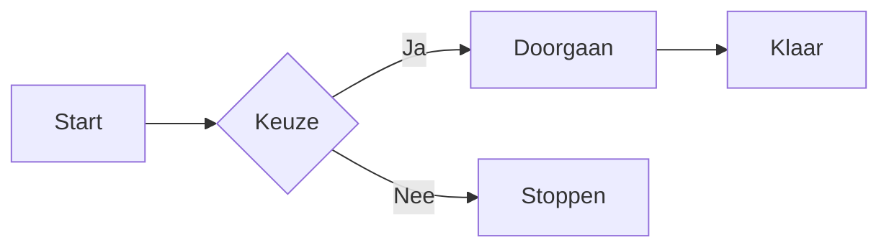
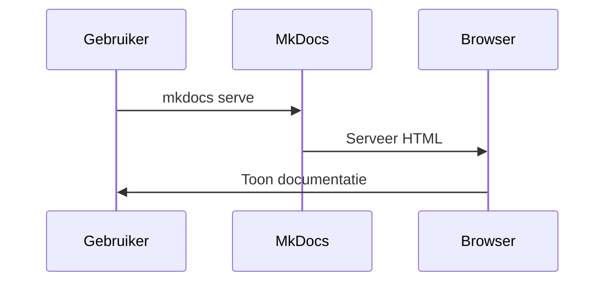
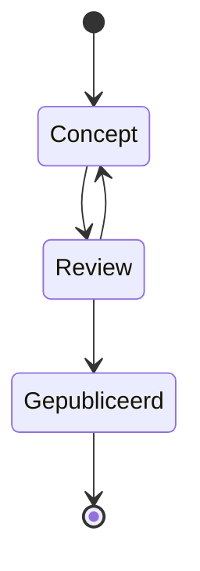

# Features

Deze pagina demonstreert de belangrijkste features van MkDocs met het
Material-thema. Gebruik deze pagina als referentie voor wat mogelijk is
binnen je documentatieomgeving.

---

## 404-pagina

MkDocs genereert automatisch een `404.html` bij het bouwen van de site. Wanneer
een bezoeker een niet-bestaande URL bezoekt, toont het Material-thema automatisch
een nette, gestyled foutpagina — zonder extra configuratie.

!!! tip "Testen"
    Typ een niet-bestaande URL in de adresbalk om de 404-pagina in actie te zien:

    [Bekijk de 404-pagina](/mkdocs-demo/bestaat-niet){ .md-button .md-button--primary }

!!! info "Lokaal vs. live"
    De 404-pagina werkt alleen correct op de **gebouwde site** via GitHub Pages
    of een andere hostingomgeving. Via `mkdocs serve` toont de lokale
    ontwikkelserver altijd zijn eigen ingebouwde 404-melding.

---

## Tags

Tags worden bovenaan de pagina getoond en maken het eenvoudig om pagina's
te categoriseren en terug te vinden via de tagpagina. Voeg tags toe via
de frontmatter bovenaan een Markdown-bestand:

```yaml
---
tags:
  - demo
  - features
  - overzicht
---
```

### Tags verbergen

Tags blijven altijd werken in de zoekfunctie en op de [tagpagina](tags.md),
ook als ze visueel verborgen zijn op de pagina zelf. Voeg `tags` toe aan de
`hide` lijst in de frontmatter om ze te verbergen:

```yaml
---
tags:
  - demo
  - features
hide:
  - tags
---
```

### Overzicht taggedrag

| Instelling | Zichtbaar op pagina | Zichtbaar in zoekfunctie | Zichtbaar op tagpagina |
|---|:---:|:---:|:---:|
| Tags zonder `hide` | ✅ | ✅ | ✅ |
| Tags met `hide: tags` | ❌ | ✅ | ✅ |
| Geen tags | ❌ | ❌ | ❌ |

!!! tip "Best practice"
    Voeg tags altijd toe via de frontmatter, ook als je ze visueel verbergt.
    Ze blijven dan doorzoekbaar en zichtbaar op de tagpagina.

---

## Admonitions

Admonitions zijn gekleurde blokken om de lezer te attenderen op
belangrijke informatie. MkDocs Material ondersteunt meerdere typen.

!!! note "Opmerking"
    Dit is een informatieve opmerking, handig voor aanvullende uitleg.

!!! tip "Tip"
    Gebruik tips om de lezer te wijzen op handige trucs of shortcuts.

!!! warning "Let op"
    Gebruik dit blok om de lezer te waarschuwen voor mogelijke valkuilen.

!!! danger "Gevaar"
    Dit blok is bedoeld voor kritieke meldingen die directe aandacht vereisen.

!!! success "Succes"
    Gebruik dit om een succesvol resultaat of een positieve bevestiging te tonen.

!!! info "Informatie"
    Extra achtergrondinformatie die niet direct noodzakelijk is, maar nuttig kan zijn.

??? example "Uitklapbaar voorbeeld (klik om te openen)"
    Dit is een collapsible admonition. De inhoud is standaard verborgen
    en kan worden uitgeklapt door op de titel te klikken.

---

## Code Blokken

Code blokken worden gerenderd met syntaxkleuring en een ingebouwde
kopieerknop. Meerdere programmeertalen worden ondersteund.

```python title="hello_world.py" linenums="1"
def hello_world(name: str) -> str:
    """Geeft een begroeting terug."""
    return f"Hallo, {name}!"

print(hello_world("MkDocs"))
```

```bash title="installatie"
pip install mkdocs mkdocs-material
mkdocs serve
```

```yaml title="mkdocs.yml"
site_name: Mijn Documentatie
theme:
  name: material
  language: nl
```

---

## Content Tabs

Met content tabs kun je gerelateerde inhoud naast elkaar tonen, zoals
voorbeeldcode in meerdere programmeertalen.

=== "Python"
    ```python
    def groet():
        print("Hallo vanuit Python!")
    ```

=== "JavaScript"
    ```javascript
    function groet() {
        console.log("Hallo vanuit JavaScript!");
    }
    ```

=== "Bash"
    ```bash
    echo "Hallo vanuit Bash!"
    ```

=== "PowerShell"
    ```powershell
    Write-Host "Hallo vanuit PowerShell!"
    ```

---

## Grids & Cards

Cards bieden een visuele manier om features of onderwerpen overzichtelijk
te presenteren.

<div class="grid cards" markdown>

-   :material-clock-fast:{ .lg .middle } __Snel opgezet__

    ---

    Binnen enkele minuten een professionele documentatiesite draaien
    met MkDocs en het Material-thema.

-   :material-language-markdown:{ .lg .middle } __Markdown__

    ---

    Schrijf documentatie in eenvoudige Markdown-syntax, zonder kennis
    van HTML of CSS.

-   :material-magnify:{ .lg .middle } __Zoekfunctie__

    ---

    Ingebouwde zoekfunctie doorzoekt alle pagina's direct in de browser,
    zonder externe diensten.

-   :material-palette:{ .lg .middle } __Thema & Stijlen__

    ---

    Pas kleuren, lettertypen en de lay-out volledig aan via de
    `mkdocs.yml` configuratie.

</div>

---

## Knoppen

MkDocs Material ondersteunt gestylede knoppen via CSS-klassen. Knoppen
kunnen worden gebruikt als call-to-action of voor navigatie.

[Primaire knop](#){ .md-button .md-button--primary }
[Secundaire knop](#){ .md-button }

---

## Afkortingen (Abbreviations)

Door gebruik te maken van het `includes/abbreviations.md` bestand worden
afkortingen automatisch voorzien van een tooltip. Beweeg je muis over de
onderstaande afkortingen om de uitleg te zien.

Deze documentatie is gebouwd met MkDocs en maakt gebruik van YAML voor
de configuratie. De HTML-output wordt gegenereerd via een CLI-commando.

--8<-- "includes/abbreviations.md"

---

## Mermaid Diagrammen

Met Mermaid kun je diagrammen en flowcharts schrijven in Markdown.
Onderstaande voorbeelden laten verschillende diagramtypen zien.

**Flowchart:**



**Sequentiediagram:**



**Statusdiagram:**



---

## Takenlijsten

Takenlijsten zijn handig om stappen of checklists overzichtelijk weer te
geven. Met de `tasklist` extensie worden de checkboxen visueel gestijld.

- [x] MkDocs installeren
- [x] Material-thema instellen
- [x] Navigatie configureren
- [x] Features pagina aanmaken
- [ ] Documentatie uitschrijven
- [ ] Publiceren naar GitHub Pages

---

## Tabellen

Tabellen worden volledig ondersteund in Markdown en zijn eenvoudig
leesbaar en uitbreidbaar.

| Feature            | Beschikbaar | Notitie                          |
|--------------------|:-----------:|----------------------------------|
| Tags               | ✅          | Via `material/tags` plugin       |
| Mermaid diagrammen | ✅          | Via `pymdownx.superfences`       |
| Zoekfunctie        | ✅          | Ingebouwd, geen plugin nodig     |
| Content Tabs       | ✅          | Via `pymdownx.tabbed`            |
| Admonitions        | ✅          | Via `admonition` extensie        |
| Afkortingen        | ✅          | Via `abbr` + snippets            |
| Knoppen            | ✅          | Via `attr_list` extensie         |
| Footnotes          | ✅          | Via `footnotes` extensie         |
| Grids & Cards      | ✅          | Via `md_in_html` + CSS klassen   |
| Versiebeheer       | ⚙️          | Via `mike` plugin (optioneel)    |

---

## Footnotes

Voetnoten zijn handig voor bronvermeldingen of aanvullende uitleg die de
hoofdtekst niet onderbreekt. Klik op het cijfer om naar de voetnoot te
springen.[^1]

MkDocs is een open-source project en actief onderhouden door de
community.[^2]

[^1]: Dit is een voetnoot. Je kunt hier bronvermeldingen of aanvullende
      informatie kwijt zonder de leesflow te onderbreken.
[^2]: Meer informatie op [mkdocs.org](https://www.mkdocs.org) en
      [squidfunk.github.io/mkdocs-material](https://squidfunk.github.io/mkdocs-material).

---

## Iconen & Emoji

MkDocs Material ondersteunt iconen uit drie bibliotheken: **Material
Design Icons**, **FontAwesome** en **Octicons**. Iconen kunnen inline in
tekst worden gebruikt.

| Bibliotheek       | Voorbeeld gebruik                   | Resultaat                       |
|-------------------|-------------------------------------|---------------------------------|
| Material Design   | `:material-check-circle:`           | :material-check-circle:         |
| Material Design   | `:material-alert-circle:`           | :material-alert-circle:         |
| FontAwesome       | `:fontawesome-brands-github:`       | :fontawesome-brands-github:     |
| FontAwesome       | `:fontawesome-brands-python:`       | :fontawesome-brands-python:     |
| Octicons          | `:octicons-repo-16:`                | :octicons-repo-16:              |
| Emoji             | `:smile:`                           | :smile:                         |