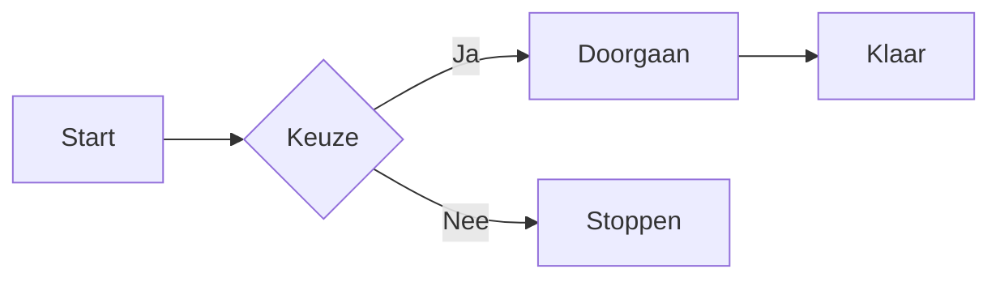
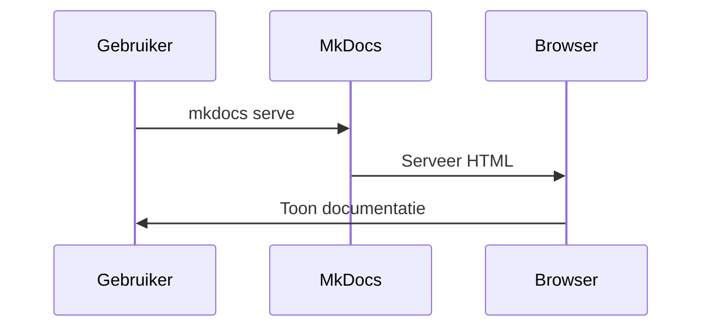
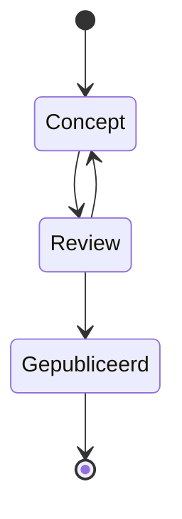

---
tags:
title: Feature - Diagrammen
  - features
  - mermaid
hide:
  - tags
---

# Diagrammen

Met Mermaid kun je diagrammen en flowcharts schrijven in Markdown.
Onderstaande voorbeelden laten verschillende diagramtypen zien.

---

## Flowchart

---

## Sequentiediagram

---

## Statusdiagram

