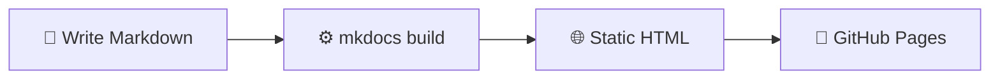

---
tags:
  - mkdocs
  - introduction
hide:
  - tags
---

# Introduction

MkDocs is a static site generator specifically designed for project documentation.
You write your content in **Markdown**, and MkDocs automatically builds a complete
website from it.

## Why MkDocs?

!!! tip "No web development required"
    You don't need to know HTML, CSS or JavaScript. Everything you write in
    Markdown is automatically converted into a professional website.

Key advantages at a glance:

- **Fast**: the site is statically generated — no server needed
- **Simple**: documentation in Markdown, configuration in a single YAML file
- **Beautiful**: the Material theme gives you a professional result right away
- **Free hosting**: publish automatically with every commit via GitHub Pages

## How does it work?



## Project structure

A typical MkDocs project looks like this:

```
mkdocs-demo/
│
├── mkdocs.yml
├── README.md
│
├── .github/
│   └── workflows/
│       └── deploy.yml
│
└── docs/
    ├── index.md
    ├── features.md
    ├── changelog.md
    ├── tags.md
    │
    ├── about/
    │   └── index.md
    │
    ├── blog/
    │   ├── .authors.yml
    │   ├── index.md
    │   └── posts/
    │       └── 2026-05-07-welkom.md
    │
    ├── getting-started/
    │   ├── index.md
    │   ├── install.md
    │   ├── deployment.md
    │   └── alternatieven.md
    │
    └── includes/
            abbreviations.md
```

## Code annotations

A powerful feature of MkDocs Material is the ability to add numbered annotations
to code. Click on the numbers to see the explanation:

```yaml
theme:
  name: material # (1)!
  language: nl   # (2)!
  palette:
    - scheme: slate # (3)!
```

1. The Material theme gives you a professional look right away.
2. All UI elements are automatically translated to Dutch.
3. `slate` is the dark mode — switchable via the toggle in the top right.

---

Ready to get started? Go to the [installation page](install.md), check out the
[deployment options](deployment.md) or compare MkDocs with
[other documentation tools](alternatieven.md).

[Installation :material-arrow-right:](install.md){ .md-button .md-button--primary }
[Deployment :material-rocket-launch:](deployment.md){ .md-button }
[Alternatives :material-scale-balance:](alternatieven.md){ .md-button }