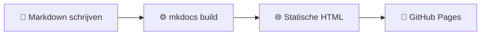

---
tags:
  - mkdocs
  - introductie
---

# Introductie

MkDocs is een statische sitegenerator speciaal ontworpen voor projectdocumentatie. Je schrijft je inhoud in **Markdown**, en MkDocs bouwt er automatisch een volledige website van.

## Waarom MkDocs?

!!! tip "Geen webontwikkeling nodig"
    Je hoeft geen HTML, CSS of JavaScript te kennen. Alles wat je schrijft in Markdown wordt automatisch omgezet naar een professionele website.

Belangrijkste voordelen op een rij:

- **Snel**: de site wordt statisch gegenereerd — geen server nodig
- **Eenvoudig**: documentatie in Markdown, configuratie in één YAML-bestand
- **Mooi**: het Material-thema geeft direct een professioneel resultaat
- **Gratis hosting**: via GitHub Pages publiceer je automatisch bij elke commit

## Hoe werkt het?



## Structuur van dit project

Een typisch MkDocs-project ziet er zo uit:

```
project/
├── mkdocs.yml              ← configuratie
└── docs/
    ├── index.md            ← homepage
    ├── includes/
    │   └── abbreviations.md
    ├── getting-started/
    │   ├── index.md
    │   └── install.md
    └── about/
        └── index.md
```

## Code annotaties

Een krachtige functie van MkDocs Material is de mogelijkheid om code te voorzien van genummerde annotaties. Klik op de nummers om de uitleg te zien:

```yaml
theme:
  name: material # (1)!
  language: nl   # (2)!
  palette:
    - scheme: slate # (3)!
```

1. Het Material-thema geeft je direct een professionele uitstraling.
2. Alle UI-elementen worden automatisch vertaald naar Nederlands.
3. `slate` is de donkere modus — schakelbaar via de toggle rechtsboven.

Klaar om te beginnen? Ga naar de [installatiepagina](install.md).